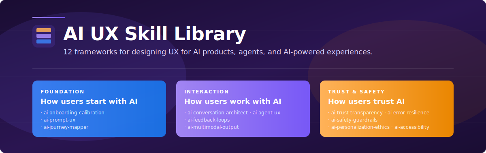
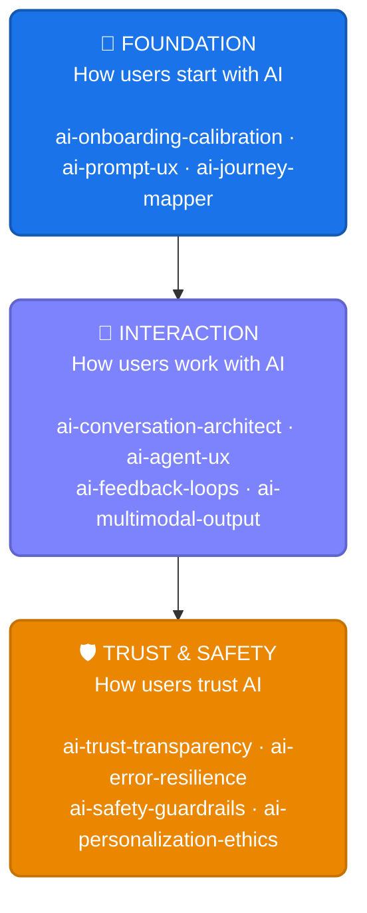

<div align="center">



# AI UX Skill Library

### The 12-Skill AI UX Design Engine for Claude Code & GitHub Copilot

[](#skills-catalog)
[](#framework-quick-reference)
[](LICENSE)
[](https://claude.ai/code)

**Created and maintained by [Varun Kulkarni](https://github.com/varunk130)** · [⚡ Quickstart ↓](#-quickstart) · [Skills Catalog ↓](#skills-catalog) · [Frameworks ↓](#framework-quick-reference)

**Purpose-built, framework-driven skills for designing UX for AI products, AI agents, and AI-powered experiences.** Each skill encodes a proprietary framework for the unique UX challenges that only exist when humans interact with AI — trust calibration, hallucination recovery, agentic control, prompt interfaces, and more.

</div>

---

## ⚡ Quickstart

```bash
# 1. Clone the repo
git clone https://github.com/varunk130/ai-ux-skill-library.git

# 2. Install all 12 skills globally for Claude Code
mkdir -p ~/.claude/skills
cp -r ai-ux-skill-library/skills/* ~/.claude/skills/

# 3. Restart Claude Code, then invoke any framework:
#      /ai-conversation-architect   — DIALOGUE framework for chat UX
#      /ai-trust-transparency       — GLASS framework for explainability
#      /ai-agent-ux                 — AUTONOMY framework for agentic UX
```

> 💡 Full setup including GitHub Copilot integration is in [Installation](#installation) below.

---

## Why This Exists

> **Traditional UX skills don't cover AI.** When your product can hallucinate, act autonomously, and produce different outputs from the same input — you need a new UX design vocabulary. This library provides it.

General UX skills (journey mapping, accessibility, design systems) are well-served by existing resources. This library focuses exclusively on the **delta** — the 12 UX challenges that are unique to AI products and don't exist in traditional software or digital products.

---

## Ecosystem Architecture

The skills are organized into **3 design phases** for AI products:



---

## Skills Catalog

12 skills total — 10 core skills (numbered 1–10) plus 2 bonus skills (output/multimodal and accessibility) that extend coverage to rendering and inclusive design.

| # | Skill | Framework | Phase | What It Solves |
|---|-------|-----------|-------|---------------|
| 1 | AI Conversation Architect | `DIALOGUE` | Interaction | Conversational AI interfaces - turn-taking, persona voice, multi-turn context, error recovery |
| 2 | AI Trust & Transparency | `GLASS` | Trust & Safety | Explainability UX - confidence indicators, citation design, source attribution |
| 3 | AI Error Resilience | `RECOVER` | Trust & Safety | Hallucinations, uncertainty, graceful degradation, safe fallbacks |
| 4 | AI Agent UX | `AUTONOMY` | Interaction | Agentic AI - autonomy controls, consent, action previews, undo/rollback, audit trails |
| 5 | AI Onboarding & Calibration | `CALIBRATE` | Foundation | Progressive disclosure, mental model calibration, expectation setting |
| 6 | AI Feedback Loops | `SIGNAL` | Interaction | RLHF UX - thumbs up/down, preference ranking, human-in-the-loop |
| 7 | AI Prompt UX | `CRAFT` | Foundation | Prompt interface design - input affordances, templates, suggestions |
| 8 | AI Personalization & Ethics | `ADAPT` | Trust & Safety | Adaptive interfaces, privacy balance, filter bubble prevention |
| 9 | AI Safety Guardrails | `SHIELD` | Trust & Safety | Content moderation UX, bias detection, harm prevention, refusal design |
| 10 | AI Journey Mapper | `PATHWAY` | Foundation | AI-specific journey mapping - trust arcs, capability discovery, autonomy transitions |
| **Bonus** | AI Output & Multimodal Design | `RENDER` | Interaction | Response formatting, output hierarchy, cross-modal presentation |
| **Bonus** | AI Accessibility Audit | `CLEAR` | Trust & Safety | WCAG 2.2 AA audit tailored to AI surfaces - keyboard, screen reader, captions, motion |

---

## Framework Quick Reference

| Framework | Mnemonic | Core Concept |
|-----------|----------|-------------|
| **DIALOGUE** | _D_iscover, _I_dentify, _A_dapt, _L_ayer, _O_ffer, _G_uard, _U_nderstand, _E_xit | Design conversations, not command lines |
| **GLASS** | _G_round, _L_ayer, _A_dvertise, _S_how, _S_upport | Make AI reasoning visible |
| **RECOVER** | _R_ecognize, _E_xpress, _C_ontain, _O_ffer, _V_erify, _E_volve, _R_estore | Treat errors as design material |
| **AUTONOMY** | _A_ction, _U_ser, _T_iered, _O_bservable, _N_arrated, _O_utcome, _M_emory, _Y_ield | Users supervise, AI executes |
| **CALIBRATE** | _C_ommunicate, _A_nchor, _L_ayer, _I_nvite, _B_uild, _R_ecalibrate, _A_dapt, _T_rack, _E_volve | Onboarding is calibration, not tutorial |
| **SIGNAL** | _S_urface, _I_ncentivize, _G_raduate, _N_arrate, _A_ggregate, _L_oop | Feedback is a transaction - close the loop |
| **CRAFT** | _C_onstrain, _R_eveal, _A_ssist, _F_ormat, _T_each | A blank text box is not a prompt UX |
| **ADAPT** | _A_gency, _D_ata, _A_lternatives, _P_atterns, _T_ested | Personalization is a power dynamic |
| **SHIELD** | _S_cope, _H_uman, _I_nform, _E_scalation, _L_og, _D_egrade | Safety and usability are not opposites |
| **PATHWAY** | _P_erception, _A_utonomy, _T_rust, _H_elp, _W_ow, _A_nxiety, _Y_ield | Map what users BELIEVE, not just what they DO |
| **RENDER** | _R_ight, _E_asy, _N_avigable, _D_irectly, _E_ditable, _R_eproducible | AI generates output. Humans consume meaning |
| **CLEAR** | _C_ontrast, _L_abels, _E_quivalents, _A_ssist, _R_esponsive | WCAG 2.2 AA audit tailored to AI surfaces |

---

## Quickstart Workflows

### Designing a New AI Chat Product
```
ai-onboarding-calibration → ai-prompt-ux → ai-conversation-architect →
ai-trust-transparency → ai-error-resilience → ai-feedback-loops
```

### Designing an AI Agent Experience
```
ai-journey-mapper → ai-agent-ux → ai-safety-guardrails →
ai-trust-transparency → ai-feedback-loops
```

### Auditing an Existing AI Product
```
ai-journey-mapper → ai-trust-transparency → ai-error-resilience →
ai-safety-guardrails → ai-personalization-ethics
```

### Improving AI Adoption & Retention
```
ai-onboarding-calibration → ai-journey-mapper → ai-feedback-loops →
ai-personalization-ethics
```

---

## Installation

Each skill is a standalone `SKILL.md` file that can be installed into your Claude Code or GitHub Copilot environment.

### Claude Code

```bash
# Clone this repo
git clone https://github.com/varunk130/ai-ux-skill-library.git

# Copy all skills to your Claude Code skills directory
cp -r ai-ux-skill-library/skills/* ~/.claude/skills/

# Or install a single skill
cp -r ai-ux-skill-library/skills/ai-agent-ux ~/.claude/skills/
```

### GitHub Copilot

```bash
# Clone this repo
git clone https://github.com/varunk130/ai-ux-skill-library.git

# Copy all skills to your GitHub Copilot instructions directory
cp -r ai-ux-skill-library/skills/* .github/skills/

# Or install a single skill
cp -r ai-ux-skill-library/skills/ai-agent-ux .github/skills/
```

---

## What Makes These Skills Unique

1. **AI-only problems** - Every skill targets a UX challenge that does NOT exist in traditional software (trust arcs, hallucination recovery, autonomy dials)
2. **Proprietary frameworks** - Each skill has a named, mnemonic framework (DIALOGUE, GLASS, RECOVER, etc.) with original scoring rubrics and decision matrices
3. **Anti-pattern catalogs** - Every skill includes specific anti-patterns with explanations of why they fail, not just best practices
4. **Cross-skill integration** - Skills reference each other, creating a composable system where outputs from one skill feed into another
5. **Opinionated defaults** - Specific numbers, thresholds, and recommendations rather than "it depends" advice

---

## Directory Structure

```
ai-ux-skill-library/
├── README.md
├── LICENSE
└── skills/
    ├── ai-conversation-architect/SKILL.md   # DIALOGUE Framework
    ├── ai-trust-transparency/SKILL.md       # GLASS Framework
    ├── ai-error-resilience/SKILL.md         # RECOVER Framework
    ├── ai-agent-ux/SKILL.md                 # AUTONOMY Framework
    ├── ai-onboarding-calibration/SKILL.md   # CALIBRATE Framework
    ├── ai-feedback-loops/SKILL.md           # SIGNAL Framework
    ├── ai-prompt-ux/SKILL.md                # CRAFT Framework
    ├── ai-personalization-ethics/SKILL.md   # ADAPT Framework
    ├── ai-safety-guardrails/SKILL.md        # SHIELD Framework
    ├── ai-accessibility-audit/SKILL.md      # CLEAR Framework (Bonus, WCAG 2.2 AA)
    ├── ai-journey-mapper/SKILL.md           # PATHWAY Framework
    └── ai-multimodal-output/SKILL.md        # RENDER Framework (Bonus)
```

---

## Contributing

We welcome contributions! To add or improve a skill:

1. Fork this repository
2. Create a feature branch (`git checkout -b improve-skill-name`)
3. Update the `SKILL.md` in the relevant skill directory
4. Submit a Pull Request with a description of your changes

---

## Related Work

Part of a portfolio of AI agent and skill libraries for product, GTM, and decision-making teams.

**Discovery & research**

- [ai-customer-discovery-skills](https://github.com/varunk130/ai-customer-discovery-skills) - Turn raw customer signal into validated product opportunities (5 of 12 shipped)
- [jtbd-extractor](https://github.com/varunk130/ai-customer-discovery-skills/tree/main/skills/jtbd-extractor) - Extract Jobs-to-be-Done statements from research, with opportunity scoring

**Strategy & decisions**

- [claude-code-skills](https://github.com/varunk130/claude-code-skills) - 29 production-grade skills for finance, product, strategy, and game theory
- [AI-Builder-Decision-Analyst](https://github.com/varunk130/AI-Builder-Decision-Analyst) - 11 skills that catch bad bets before you ship across DECIDE / BUILD / COMMUNICATE / LEARN

**Go-to-market**

- [ai-gtm-skill-library](https://github.com/varunk130/ai-gtm-skill-library) - 31 opinionated GTM skills across the full discover -> renew lifecycle
- [ai-marketing-claude-skills](https://github.com/varunk130/ai-marketing-claude-skills) - 12 marketing-ops skills with scoring algorithms and statistical frameworks
- [ai-partner-ecosystem-analysis](https://github.com/varunk130/ai-partner-ecosystem-analysis) - Deep research on any ISV, partner, or competitor with a 1-slide PPTX output

**Multi-agent demos**

- [ai-pm-agents-suite](https://github.com/varunk130/ai-pm-agents-suite) - 6-agent pipeline plus 3 standalone PM agents (decision engine, financial analyst, stakeholder translator) that turn customer feedback into strategy, PRDs, and comms
- [ai-legal-team-agent](https://github.com/varunk130/ai-legal-team-agent) - 4-agent legal analysis team with Python orchestrator and Claude Code skills

**Evaluation & operations**

- [AI-Eval-Skills](https://github.com/varunk130/AI-Eval-Skills) - 6 skills to plan, generate, run, interpret, and triage AI agent evaluations
- [ai-workflow-playbooks](https://github.com/varunk130/ai-workflow-playbooks) - 21 playbooks + 10 skills + 4 guardians + 5 runbooks across the 7-stage delivery pipeline

---

## License

This project is licensed under the MIT License — see [LICENSE](LICENSE) for the full text.

---

<div align="center">

**Built by Varun Kulkarni**

*Powered by Claude Code & GitHub Copilot*

</div>
